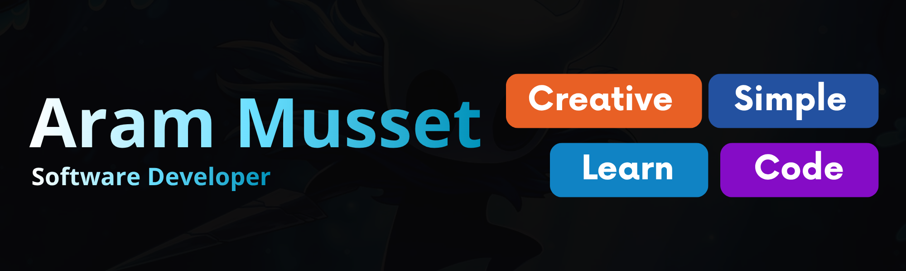

  

  

## Sobre Mi

Soy <strong>Aram Musset</strong>, desarrollador Full-Stack y estudiante de desarrollo de software. Me especializo en construir aplicaciones robustas y escalables, guiado por principios de código limpio, buenas prácticas y un compromiso constante con la calidad.

  📍 Santo Domingo Este, República Dominicana.

## Tech Stack

  

 

  

  Edicion: 21/04/2026

